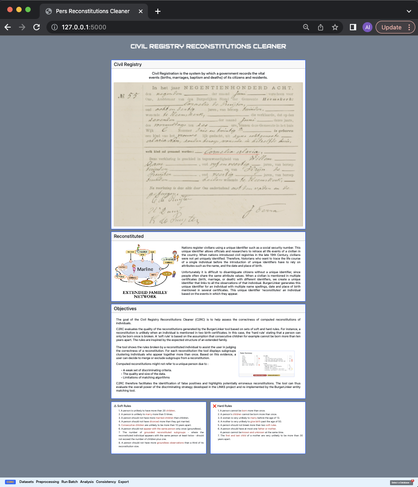

<!------------------------------------------------------------------------------------->
# C2RC : Civil Registry Reconstitutions Cleaner 
<!------------------------------------------------------------------------------------->

**C2RC**
comes as a second phase to an effort to uniformly identify registered citizens within Civil Registries[^1] dating back to the 19th and early-20th century, an era before the introduction of social security numbers or other unique identifiers.

In its first phase, CLARIAH, the Common Lab Research Infrastructure for the Arts and Humanities created the **BurgerLinker** tool for the **reconstitution**[^2] of registered individuals based on mentioned person observations with a level of tolerance on name spellings examined across certificates of two to three family members. For a more accurate results, BurgerLinker makes use of a number of restrictions such as time-range to exclude biologically impossible matches between certificates that can occur when only name spellings are considered.

To evaluate BurgerLinker's result, **C2RC** examines a reconstituted  by investigating its extended family based on rules and evidence relative to the reappearance of the individual with the same family member. These two approaches enable the user to spot potential issues (broken rules and/or inconsistent or unsuported extended family) and rearrange BurgerLinker's reconstitution accordingly.

<!------------------------------------------------------------------------------------->
# <strong style="color:brown"> **C2RC Menu** </strong>
<!------------------------------------------------------------------------------------->

**C2RC**  offers seven menu tabs that cover data upload and preparation as well as clusters evaluations and validations. During this process, C2RC makes available all created data for download as RDF graphs.

We provide below a brief overview of each menu tab.

1. Home page
> The home page introduces the tool by defining some key concepts, describing its goals and clarifying the ways in which the tool is of help to a user for evaluating and validating reconstitutions generated by BurgerLinker's.  
 
 
2. Datasets
> The Datasets menu tab enables the user to upload a pair of datasets for analysis.   In order to evaluate the result generated by BurgerLinker over a specific Civil Registry dataset, the pair of input-datasets includes the BurgerLinker's rdf result graph and the related Civil Registry dataset in an RDF representation. 
 

3. Preprocessing
> The Preprocessing menu tab enables the tool to brake down the input-datasets into smaller data structure objects and saves them into deferent tables for faster access. 

4. Run Batch
> BurgerLinker generates reconstitutions of registered individuals which are in other words clusters of mentioned person observations. These reconstitutions are generated such that all mentioned persons within a specific cluster share the same unique identifier.
> 
> As the BurgerLinker result graph is composed of clusters of various sizes, the Run Batch menu tab allows the user to run and save the automated evaluation of clusters of a requested size.

5. Analysis
> The Analysis menu tab enables the user to (i) go through a set of reconstitutions of the same size, (ii) investigate the automated evaluations, (iii) confirm or split the the evaluated reconstitution accordingly and (iv) ensure that the family members of the reconstituted are consistently validated.

6. Consistency
> The Consistency menu tab works in combination with the Analysis menu tab as it extends the latter so that impacted family members displayed in the Analysis menu tab can be consistently validated according to the validation which occured in the Analysis page. 

7. Export
> The Export menu tab offers the user several download options that include the automated evaluations, the manual validations as well as the family relation graph generated during the data preprocessing steps.
 

<!-- 1. C2RC HOME PAGE ---------------------------------------------------------------->
## <strong style="color:brown"> **C2RC Home Page** </strong>
<!------------------------------------------------------------------------------------->
Figure 1 shows C2RC home page which introduces key concepts, describes its goals and hints on the ways in which the tool can be of help to a user for an automated evaluation as well as manual validations of BurgerLinker's results and for exporting these automated evaluations and manual corrections or validations. 

*Fig 1: C2RC Home Page*

<strong style="color:brown"> NEXT : </strong> To start using the C2RC, click on the <strong style="color:green"> **Dataset** </strong> menu button to create one or more datasets where evaluation results of a specific BurgerLinker graph can be saved and used as a base for corrections or validations of a reconstitution. 

[^1]: **Civil Registry** records vital events such as birth, marriages, divorces and death of citizens.\
[^2]: A **reconstitution** is the clustering of observations for the purpose of uniquely identifying the observed. In this context, as the work is about registered civilians, a **reconstituted** referrers to a uniquely identified mentioned citizen.

