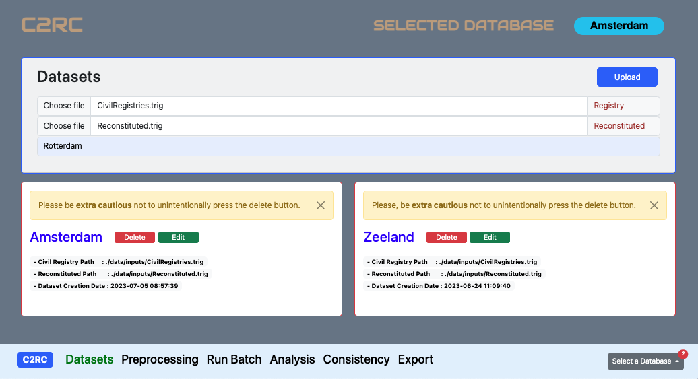
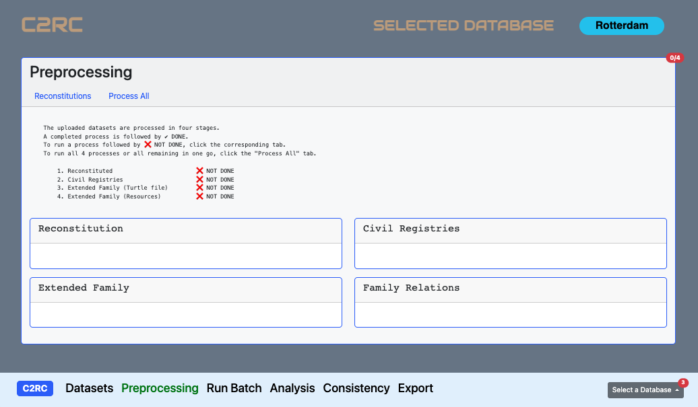
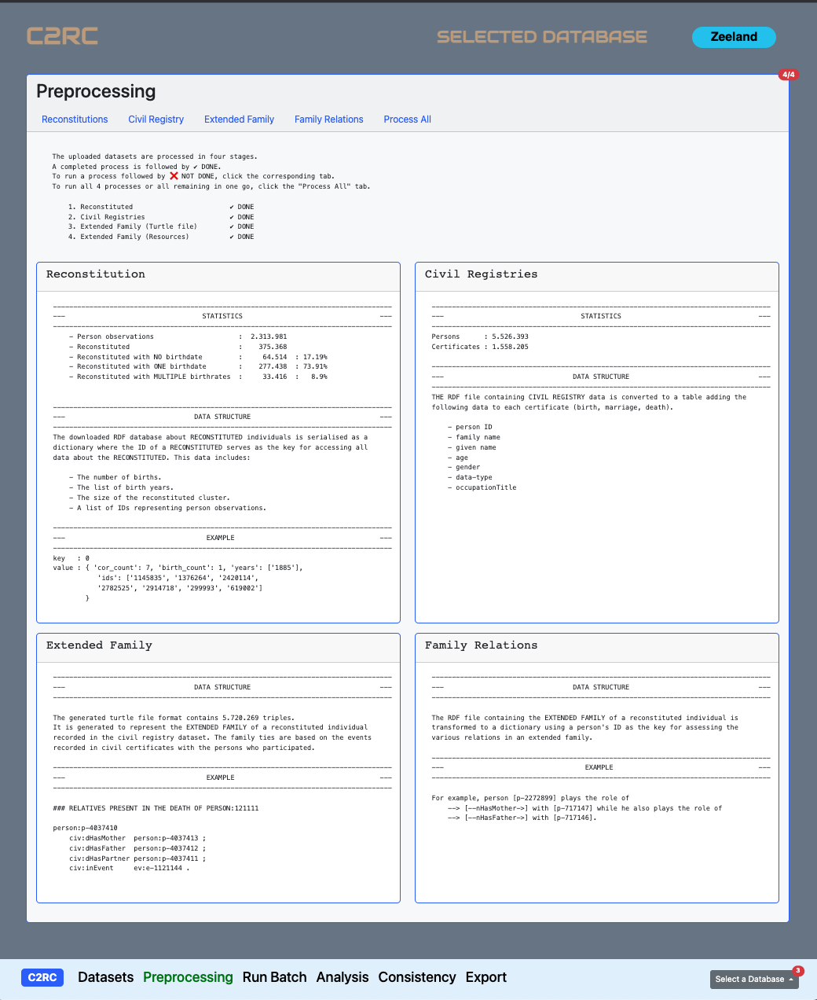
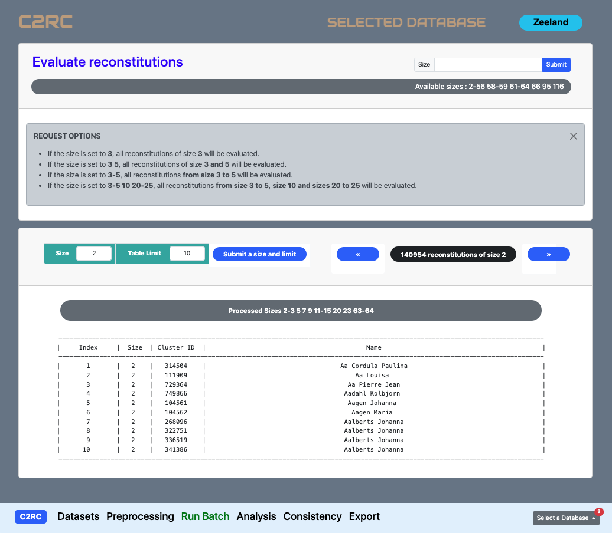

<!-- Data Preparation --------------------------------------------->
# <strong style="color:brown"> **DATA PREPARATION** </strong>
<!----------------------------------------------------------------->
We introduce here C2RC features related to data ingestion, preprocessing and the evaluations of a set of clusters that all share the same user requested size.

<!-- 2. DATASETS -------------------------------------------------->
## <strong style="color:brown"> **1. Datasets** </strong>
<!----------------------------------------------------------------->

C2RC uses two sets of RDF data or named graphs. The first graph is the *Civil  Registry dataset* which describes certificates in term of person observations. This is also the dataset used as *BurgerLinker*'s input. The second graph is the result of *BurgerLinker* which is referred to as *Reconstitutions* or *reconstituted* in this work.

To create a new dataset in C2RC, select the Civil Registry and BurgerLinker Reconstitutions datasets from your computer file system, fill out the dataset name and upload the files. Once the download is completed, the newly created dataset will appear below the Dataset card with the options to Delete or Edit the database's name as can be seen in Figure 1.

Any newly cerated dataset becomes the selected dataset by default. The selected dataset is visible at the top right corner of the page as a blue badge. The Dropdown button at the right side of the menu bar offers the possibility to select a different dataset while indicating the number of created datasets using the red badge in its right corner.

<strong style="color:brown"> NEXT : </strong> To run an evaluation of a set of clusters of a specific size, click on the <strong style="color:green"> **Preprocessing** </strong> menu button.

*Fig 1: Create - Select - Edit - Delete a dataset using C2RC.*

<!-- 3. DATA PREPROCESSING ---------------------------------------->
## <strong style="color:brown"> **2. Data Processing** </strong>
<!----------------------------------------------------------------->

Prior to analysing BurgerLinker's result, C2RC needs to preprocess the input-datasets. For that, data preprocessing is performed in 4 steps: Reconstitutions, Civil Registry, Extended Family and Family Relations. These steps can be run one at the time or all at once. The later is done by clicking the  **Process All**  button. To run a step by step preprocessing, run the first step by clicking on the  **Reconstitutions**  button. Once that step is completed, the next button is displayed. The same process applies up to clicking **Family Relations**, the last preprocessing button.

In general, for each reconstitution generated by *BurgerLinker*, *C2RC* extracts all person observations, creates a family member relation graph as well as means for accessing all family members. This enables the isolation of family members and facilitates the grouping of *observations shared more than once with the same family member* to help sub-clustering the reconstitution under the premisses of supported or unsupported evidence.

*Fig 2: Preprocessing C2RC input-datasets.*

While Figure 3 shows a prepossessing status card with no executed preprocess step for the selected Rotterdam dataset, Figure 4 illustrates the preprocessing results for the Zeeland dataset. The red badge at the top right corner of the Preprocessing card shows 4/4, indicating that all processes are successfully run. Also, for each run process, some statistics and/or a description are provided through four inner cards with a blue border. For example, the Reconstitution inner card specifies that Zeeland is composed of 2.313.981 person observations where approximatively 17% of the observations are not associated with a birth event. 

<strong style="color:brown"> NEXT : </strong> To trigger C2RC for an automated evaluation of clusters stemmed from a user-requested size, click on the <strong style="color:green"> **Run Batch** </strong> menu button. 

*Fig 3: An example of C2RC completed data preprocessing.*

<!-- 4. RUN BATCH ------------------------------------------------->
## <strong style="color:brown"> **3. Run Batch** </strong>
<!----------------------------------------------------------------->
BurgerLinker generates clusters of person observations such that all mentioned persons within a specific cluster share the same unique identifier. As such, C2RC runs an evaluation for (i) a group of clusters that share the same cluster size. However, it can also run (ii) a list of sizes such as **3 5 10** meaning "evaluate all clusters of size 3, 5 and 10", (iii) sizes within a particular range such as **20-25** meaning "evaluate all clusters of size 20 to size 25". For example, for an input-size like **3-5 10 20-25**, C2RC will evaluate all clusters of size 3, 4, 5, 10, 20, 21, 22, 23, 24 and 25.

Once all preprocessing steps are completed, C2RC displays a list of all cluster sizes generated by BurgerLinker within the black badge located right below the input-size box. This list can also be copied and submitted for an evaluation of the entire BurgerLinker dataset. For any input-size evaluation request, the last evaluated set of clusters sharing the same size is displayed below as a table where information such as cluster ID and mentioned name are made available. Furthermore, the maximum number or rows display in the table can be modified accordingly as well as the display of clusters of other evaluated sizes through the set of green input-boxes and blue buttons.

*Fig 4: Running an automated evaluation of reconstitutions of a specific size.*

<strong style="color:brown"> NEXT : </strong> At this stage, at least one dataset has been created, input-datasets have been uploaded and preprocessed and one or more same-size-sets of clusters have been evaluated. Now, click on the <strong style="color:green"> **Analysis** </strong> menu button to investigate, validate or correct specific automated evaluations.

