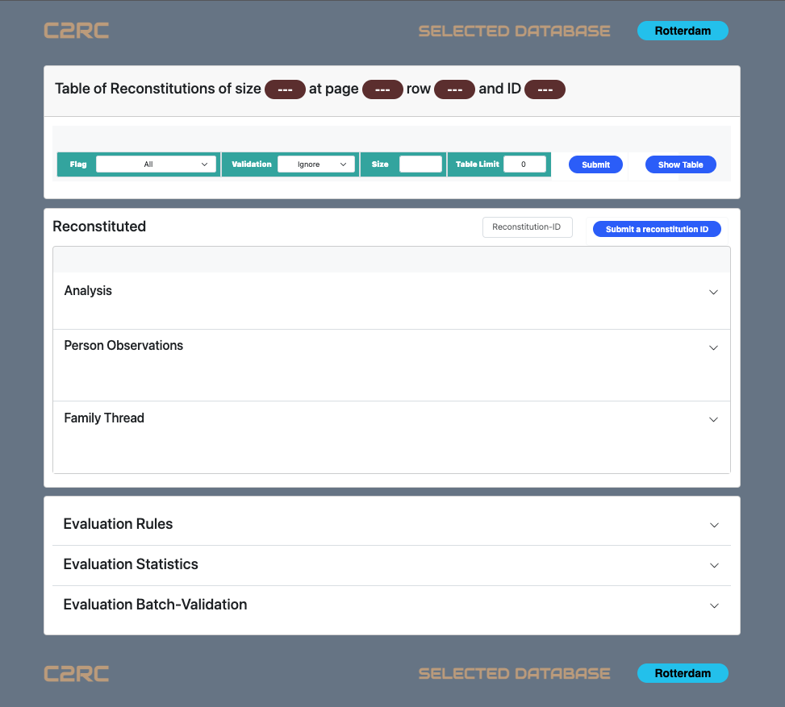

# <strong style="color:brown"> **TABLE OF CONTENT (TC)** </strong>
[Automated Evaluation](#Automated-Evaluation)

1. [Analysis Display Overview](#Analysis-Display-Overview)
2. [Reconstitutions](#Reconstitutions)
3. [Reconstituted](#Reconstituted)
	1. [Analysis](#Analysis)
	2. [Person Observations](#Person-Observations)
	3. [Family Thread](#Family-Thread)
4. [Evaluation](#Evaluation)
	1. [Rules](#Rules) 
	2. [Stats](#Stats) 
	3. [Batch Validation](#Batch-Validation) 

<!-- 5. ANALYS OF A RECONSTITUTION ---------------------------------------------------->

# <strong style="color:brown"> **AUTOMATED EVALUATION** </strong> [^TC](#TC)
<!------------------------------------------------------------------------------------->

C2RC automatically evaluates a reconstitution based on its implemented soft / hard rules (Figure 1) and cycle-based heuristic (Figure 2). It ensures a transparent evaluation by presenting to the user detailed motivations as to why it reached a specific evaluation result. These motivations, further translated into natural language, may support an intelligible understanding of it rational and may serve as supporting evidence for confirming or rejecting a manual evaluation. 

On the one hand, the automated rule-based evaluation *examines observations* defining a uniquely identified citizen while appearing in combination with members for its family. This allows C2RC to investigate the reconstituted no longer based on mentioned names but on stats related to the reconstituted as well as its relatives. For example, the reconstituted or its child cannot have more than one birth observation. 
On the other hand, the heuristic *emphasises reappearances* of the reconstituted with the same family members as supporting evidence as oppose to appearing only once with a family member. For example, by appearing on his birth and marriage certificates the parents of Leonardus corroborate observations 1.1 to 1.5. However by only appearing once with his daughter Celina, observation 1 becomes hard to corroborate.

 
 *Fig 1: Evaluation Rules*

 
 *Fig 2: C2RC Supported (yellow) versus Unsupported (red) observations based on the provided reconstitution.*

<!-- 1. OVERVIEW ---------------------------------------------------------------------->

## <strong style="color:brown"> **1. Analysis Display Overview** </strong> [^TC](#TC)
<!------------------------------------------------------------------------------------->
As Figure 6 illustrates, the analysis page is composed of three main cards:  

1. The card of reconstitutions stemmed from of a user-requested set of same-size-reconstitutions.
2. The card of reconstituted which detailed an evaluation.
3. The card about evaluation rules, statistics and batch-validations.

While Figure 3 shows the Analysis page for a non existing set of same-size-reconstitutions, Figure 4 shows an Analysis page for the Zeeland dataset about reconstitutions of size two. Identified as identifier 314504, this specific reconstitution is the one of Aa Cordula Paulina. In the next sub-sections, each card is presented in more detail.

 
 *Fig 3: Displaying and analysing an evaluation.*

 
 *Fig 4: Displaying and analysing an evaluation of cluster 314504.*

<!-- 2 RECONSTITUTIONS ---------------------------------------------------------------->

## <strong style="color: brown"> **2. Reconstitutions** </strong> [^TC](#TC)
<!------------------------------------------------------------------------------------->

The **reconstitutions** card mainly shows a table of limited (set to 10 by default) reconstitutions stemmed from a requested same-size-reconstitutions-set while the rest of its features facilitate navigating the table, hiding it and requesting the table to be filled in with reconstitutions sharing specifics traits. The reconstitutions table displays information such as reconstituted **ID**, mentioned **names**,  **validation** status, evaluation **flag** reached by C2RC and a **blue button**. While the validation status specifies whether a manual validation has been submitted or not, the evaluation flag displays the flags Likely, Uncertain and Unlikely in a green, gold and red coloured badge respectively. Clicking the blue button populates the Reconstituted card with detailed analysis of the selected reconstituted.

Figure 5 shows that the reconstitution card displays as header information relative to the selected set of same-size-reconstitutions and the location of the selected reconstitution in terms of table pagination and row numbers. In this specific case, it the header informs the user that, out of 5639 table paginations of 25 rows each, detailed analysis of reconstitution 314504 located at the first row of the first pagination populates the reconstituted card.

By default, the last set of reconstitutions executed in the <strong style="color:green"> **Run Batch** </strong> page is available to the analysis page. This set can be changed to an already processed size through the green set of input-boxes where the evaluation flag, the validation status, the size of a same-size-reconstitution-set and the maximum number of table-rows can be re-defined. All submitted requests are saved so that coning back to the exact sane state it possible, making the analysis page a **State Aware** page. While the blue <strong style="color:blue"> **Submit** </strong> button located right after the green set of input-boxes allows the submission of all user-defined requests, the <strong style="color:blue"> **Show / Hide Table** </strong> button literarily shows or hides the table to reduce the need for scrolling. Also, right above the <strong style="color:blue"> **Submit** </strong> button, the list of all evaluated / processed sizes is showed to the user as a reminder of possible same-size-reconstitutions-set to display or investigate. 

 
 *Fig 5: Displaying a same-size-set of reconstitutions.*

<!-- 3 RECONSTITUTED ------------------------------------------------------------------>

## <strong style="color: brown"> **3. Reconstituted** </strong> [^TC](#TC)
<!------------------------------------------------------------------------------------->

The **reconstituted** card shows to the user the evaluation detailed of a reconstituted individual selected from the Reconstitutions table card. In the particular case of Figure 6, reconstituted 529378 stemming from the set of clusters of size 5, table-pagination 1 and row 5 is selected to be displayed for investigation. 
The card displays the keyword "Reconstituted" as header at its top left corner. At its top right corner, the card enables the request of a reconstituted individual based on its ID. Provided that the ID exists, C2RC will fill out the reconstituted card no matter whether the reconstituted stems from an evaluated same-size-cluster-set or not
This is done by filling out the Reconstituted-ID input-box and submitting it by clicking the <strong style="color:blue"> **Submit a reconstitution ID** </strong> button. If the requested ID stems from a processed same-size-reconstitutions-set, the set is loaded to the exact reconstitutions table-page and table-row without saving the state. However, if the requested ID does not stem from a processed same-size-reconstitutions-set, only the reconstituted card is filled in with data if the ID exists.

Once done with the current reconstitution, the <strong style="color:blue"> **Next Reconstitution ID** </strong> button enables the user to move to the reconstitution. However, when the currently selected reconstitution is the last reconstitution of the reconstitutions table, clicking the button will automatically update the reconstitutions table to the next pagination if applicable and will select the first reconstitution from the updated table.

The Reconstituted card  provides to the user three types of motivating information: Analysis, Person Observations and Family thread. We provide more detail on each of the features in the next subsections.

 
 *Fig 6: Displaying a same-size-set of reconstitutions.*

<!-- 3.1 RECONSTITUTED ANALYSIS ------------------------------------------------------->
 
### <strong style="color: brown"> **3.1 Analysis** </strong> [^TC](#TC)
<!------------------------------------------------------------------------------------->
As displayed in Figure 7, the Analysis card displays in its header the evaluation conclusion flag reached by C2RC. The card uses two inner cards to provide two distinct yet related summaries intended to help explaining to the user how the evaluation flag is reached using Natural Language (first / left text-box) and Rules-based stats summary (second / right text-box).
While the right text-box of the card displays which of the rule-based investigations are violated (❌) and how many soft and hard rules are broken, the left text-box provides a summary of the right text-box in natural language. 
For example, Figure 7 shows that the left box displays the following message as a motivation for flagging the reconstitution as Unlikely. 

><strong style="color: brown"> **Blok Jacobus** </strong> appears on 3 birth certificates with 1 mother and 1 father. Married at the age of 39, he became a father of 8 children between the age of 39 and 51, of which 2 got married. The maximum age difference between two consecutive children is 2 while the first and last children are 11 years of age apart. In addition, the data show that 1 of his children points to more than one mother and / or father.

 
 *Fig 7: Natural language summary of the rule-base analysis and its supporting evidence.*

<!-- 3.3 RECONSTITUTIONS PERAON OBSERVATIONS ------------------------------------------>

### <strong style="color: brown"> **3.2 Person Observations** </strong> [^TC](#TC)
<!------------------------------------------------------------------------------------->

The Person Observations card mainly displays observations of the selected reconstituted. Only, the table is reorganised in subgroups for indicating whether the reconstituted reappeared with the same family member (yellow table background and defined as Grounded subgroups) or not (pink table background and defined as Groundless subgroups). 
At the top of the observations table are two collapsed inner cards. While the first one describes Grounded (yellow table background) and Groundless (pink table background) subgroups, the second inner card dynamically explains how to work out the table to manually confirm and use the findings displayed in the Rules' Summary box as support for a manual validation. For example, HR-2 and HR-5 are explanations for manually confirming that the reconstitution broke the hard rules related to: 
> HR-2: A person cannot be born more than once.  
> HR-5: A person's children cannot be born more than once.
 
 
 *Fig 8: Person observations table.*
 
 
 

<strong style="color:brown"> **Validation of a reconstitution.** </strong>
The table and subgroups are not only to help manually tracing back issues found by C2RC but also to support a manual user validation. C2RC offers three options for manually validating a reconstitution.

1. Validating Burgerlinker's result.
 
 In case the original reconstitution is sound, clicking the <strong style="color: blue"> **Merge and Validate** </strong> button will discard C2RC suggestions and validate the original Burgerlinker result. Once validated, the RDF validation representation displays at the end of the reconstituted card. Figure 9 shows the validation of 392855. 
 
 	
 	*Fig 9: Validated Burgerlinker's result*
 
 

 
2. Validating C2RC suggestions.
 
 Clicking on to the <strong style="color: blue"> **Submit a validation** </strong> button will instead validate the C2RC suggestions. In the case of Figure 8, reconstitution 392855 will be split into 9 new reconstitutions. Once validated, the RDF validation representation displays at the end of the reconstituted card. Figure 10 shows the validation of C2RC suggestions about reconstitution 392855.
 
 	
 	*Fig 10: Validated C2RC suggestions.*

 
3. User defined validation 
 
 However, if neither the original reconstitution nor C2RC suggestions are sound, the user has the latitude to split the reconstitution as she sees fit using the last column of the table in combination with the <strong style="color: blue"> **Submit Validation** </strong> button. Figure 11 shows an expert validation where reconstitution 392955 is split into 3 new reconstitutions while Figure 12 shows the result of the validation. In this domain expert validation, all groundless observations and subgroup-3 have been merged and assigned to subgroup-1 and observations {2.3, 2.4} and {2.5, 2.6, 2.7, 2.8, 2.9} of Subgroup-2 have been reassigned to subgroup-3 and subgroup-1 respectively. For each reconstitution split, a family thread is available to the user for consistently validating family member (see Section 3.2). The RDF representation of such validation in shown in Figure 13.

 
 	
 	*Fig 11: User validation*

 	
  	*Fig 12: Validated tables*
  
  	
  	*Fig 13: Validated RDF of reconstitution 392955*
  

<strong style="color:brown"> **Viewing and cancelling a validation.** </strong>
Once the validation of a reconstitution is submitted, the  **View the validated RDF**  button is enable. Clicking it will show the RDF version of the validation at the end of the Reconstituted card. Also, by selecting any validated reconstitution, C2RC will display a set of validated person observations table in accordance to the submitted manual validation. To cancel a validation, click the  **View the validated RDF**  button, and click the  **CANCEl**  button located at the top of the text-box showing the RDF representation.

<!-- 3.2 RECONSTITUTED FAMILY THREAD -------------------------------------------------->

### <strong style="color: brown"> **3.2 Family Thread** </strong> [^TC](#TC)
<!------------------------------------------------------------------------------------->

The third and last card constituting the collapsable Reconstituted card displays the family members of the reconstituted. We call this the *Family Thread*. It enables the user to consistently validate directly impacted family members as a consequence of the validated reconstitution if applicable. Also, the thread displays the role of the family member, its validated status and the size of its reconstitution and hints on potential problems when ever the name of a family member has more than 1 variant.

 
 *Fig 14: Family thread*

<!-- 4 RECONSTITUTIONS -------------------------------------------------------------->

## <strong style="color: brown"> **4. Evaluation** </strong> [^TC](#TC)
<!------------------------------------------------------------------------------------->
The collapsable Evaluation card is composed of 3 inner cards for:

1. <strong style="color:brown"> **Rules.** </strong> As shown in Figure 15, it is used for displaying the soft / hard evaluation rules used by C2RC.

 	
 	*Fig 15: Evaluation Rules*
 
 
 
 
2. <strong style="color:brown"> **Statistics.** </strong> This inner card is used for displaying statistics on the number of reconstitutions flagged as likely (green), uncertain (gold) and unlikely (red). The statistics on reconstitutions flagged as likely are further split into two subcategories to distinguish reconstitutions flagged as likely while having *no warning* to report from those having *one or more warnings* to report. 
While the keyword **Current** is used to indicate statistics about reconstitutions stemmed from a requested same-size-set of reconstitutions, the keyword **Overall** coverts statistics describing all processed same-size-sets. In Figure 16, out of 279.217 reconstitutions, C2RC indicates that around 51% of the reconstitutions flagged as likely have not warnings to report.

	
	*Fig 16: Evaluation Stats*

3. <strong style="color:brown"> **Batch Validation.** </strong> The batch-Validation inner card provide the user with the option to validate a group of reconstitutions rather that going though a singe validation at a time. For example, as shown in Figure 17, one can decide to confirm all evaluated reconstitutions which broke no evaluation rule.  

	
	*Fig 17: Batch Validation*

	
<strong style="color:brown"> NEXT : </strong> At this stage, at least one **dataset** has been created, **input-datasets** have been uploaded and preprocessed, one or more same-size-sets of reconstitutions have been **evaluated** and some reconstitutions may have been investigate and/or **validate**. 
Now, click on the <strong style="color:green"> **Export** </strong> menu button to export .

