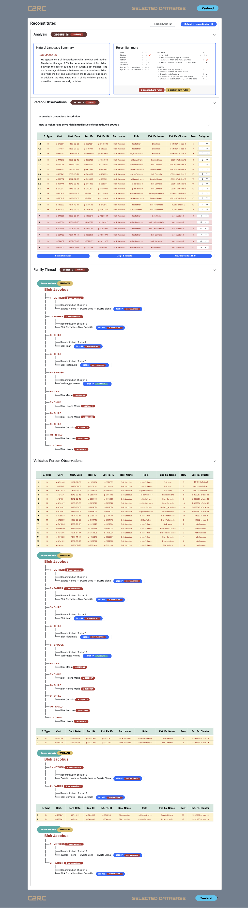

<!-- 5. ANALYS OF A RECONSTITUTION ---------------------------------------------------->

# <strong style="color:brown"> **CONSISTENCY** </strong> [^TC](#TC)
<!------------------------------------------------------------------------------------->

 

*Fig 1: Enabling consistency validation*
 
 
