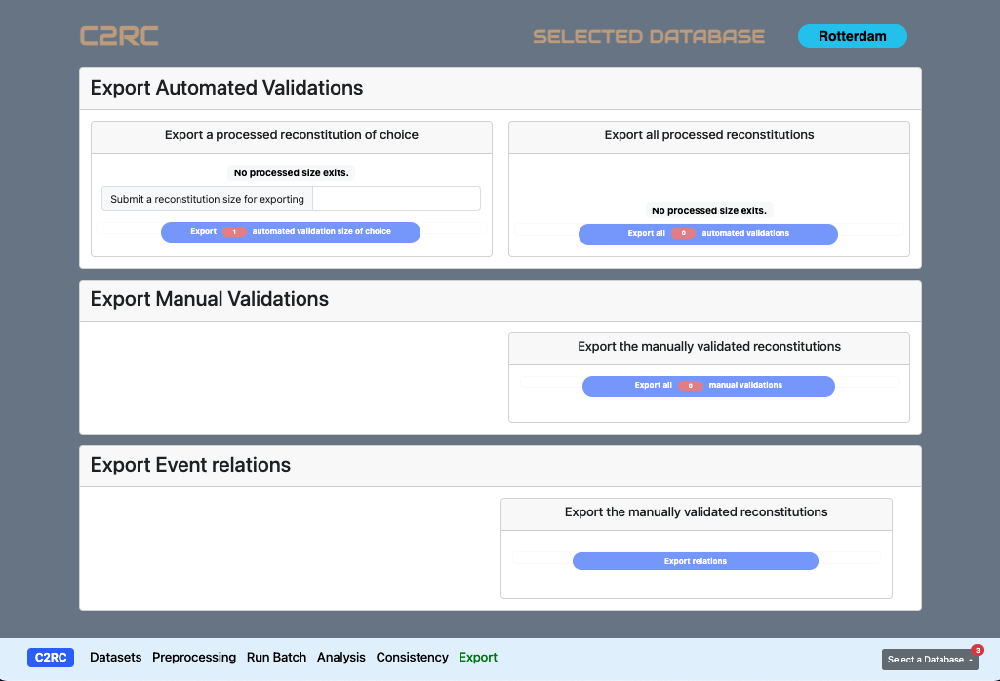
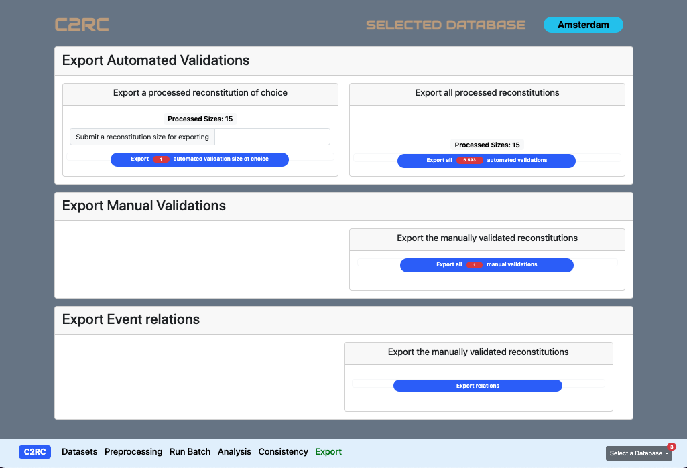

<!-- 5. ANALYS OF A RECONSTITUTION ---------------------------------------------------->

# <strong style="color:brown"> **EXPORT** </strong> [^TC](#TC)
<!------------------------------------------------------------------------------------->

C2RC offers its users options for downloading data generated 

* While preprocessing the input-data (Event relations).
* At the request of an automated evaluation.
* At the submission of a manual or batch validation. 

Whenever applicable, it is possible to request the export of automated evaluations or manual validations of all reconstitutions or of reconstitutions of a specific size. Depending on the tasks accomplished, C2RC enables the available exports options. Figure 1 for example shows the evadable options while Figure 2 shows that there are noting to export.

 
 *Fig 1: Exporting Options*

 
 *Fig 2: Exporting Options Diseabled*
 
 
 
 
 

